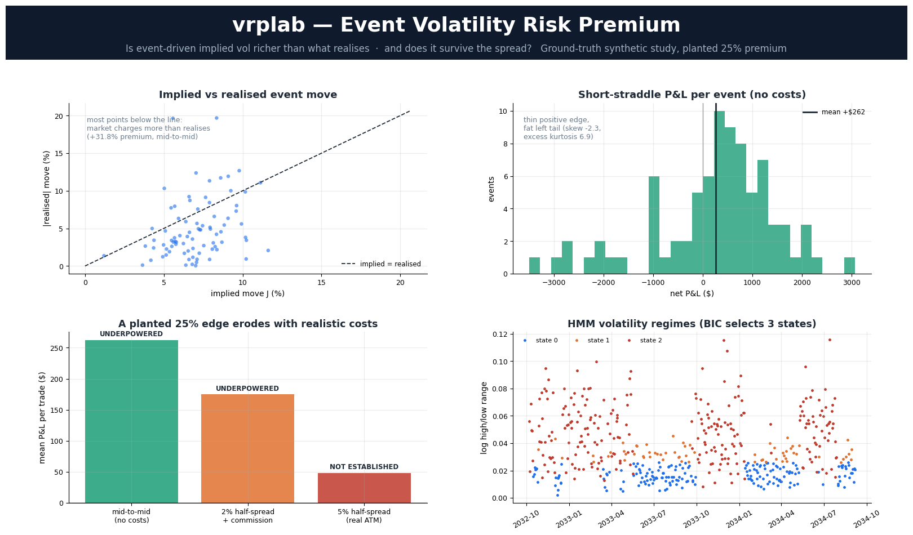

# vrplab: event volatility risk premium research platform



Five tutorial builds, collapsed into one research question and answered honestly.

| Tutorial build | What it actually measured | What it becomes here |
|---|---|---|
| Implied Volatility Trading Dashboard | IV on future IV, the persistence of a forecast, not its quality | `vol/realised.py` + `research/inference.py`: implied **vs realised**, with HAC standard errors that survive a 30-day overlap |
| Volatility Crush Trade Analyzer | one straddle repriced at a fixed `T`, per share | `backtest/straddle.py`: theta charged, multiplier applied once, spread paid twice |
| IV Crush (theory) | a correct EV framework with none of its parameters estimated | `research/eventstudy.py`: the parameters, estimated, on a panel |
| Earnings Event Dashboard | one event, n = 1, IV crush % as the headline | `research/study.py`: implied vs realised event move over every event, with a verdict |
| Markov Regime Switching Bot (parts 1-2) | percentile bins relabelled by a filter trained on different labels | `research/regime.py`: latent states by EM, BIC selection, Markov-property test, filtered probabilities only |

## The question

> Is event-driven implied volatility systematically higher than the volatility
> that subsequently realises, by enough to survive the spread, and does
> conditioning on a volatility regime change the answer?

Everything in the package exists to answer that without flattering it.

## Install

```bash
pip install -e ".[dev]"          # core + tests
pip install -e ".[ib]"           # + Interactive Brokers
python -m pytest -q              # 87 tests
```

`ibapi` is imported lazily, so the package and the 63 research tests run with no
TWS installed; the 24 IB adapter tests skip themselves if `ibapi` is absent.

### Verification status, honestly

| Layer | How far it is verified |
|---|---|
| Maths, statistics, event study, backtest | 63 tests against planted ground truth, including 22 regression tests from an external audit |
| IB adapter above the socket | 24 tests against the **real** `ibapi`, with a fake TWS driving the callbacks |
| IB adapter over a live TCP socket | **not run**, needs your TWS |
| Live `screen_from_ib` against a real chain | **not run**, needs market data entitlements |

The last two rows are yours to close. Run `examples/ib_quickstart.py` against
paper TWS; if something breaks it will be a contract or entitlement detail, not
the handshake logic, because that is what the adapter tests cover.

## Start here

```bash
python examples/run_synthetic_study.py
```

This plants a **25% event variance risk premium** in simulated data, then asks
the pipeline to find it under three cost assumptions. Actual output:

| | measured premium | mean P&L / trade | P(mean ≤ 0) | verdict |
|---|---|---|---|---|
| mid-to-mid, no costs | +31.8% | +$262 | 0.038 | **UNDERPOWERED**: needs ~145 events; you have 82 |
| 2% half-spread + commission | +31.8% | +$175 | 0.105 | **NOT ESTABLISHED** |
| 5% half-spread, 40 variants tried | +31.8% | +$48 | 0.359 | **NOT ESTABLISHED**, deflated Sharpe 0.02 |

A real, deliberately planted edge of 25% does not survive a realistic ATM
earnings spread at the sample size a single name provides. That gap, between
a mid-to-mid number and a tradeable one, is the whole point.

## Architecture

```
vrplab/
  data/
    base.py         Provider protocol, BarRequest, VolUnits, units are declared, never guessed
    synthetic.py    Ground-truth simulator: planted regimes, planted event premium, planted tail
    ib.py           Interactive Brokers adapter (see below)
    cache.py        Point-in-time parquet cache, so a study is reproducible tomorrow
  vol/
    implied.py      Black-Scholes price, Greeks (incl. vanna/volga), robust IV inversion
    termstructure.py  Event-variance decomposition, the mathematical centrepiece
    realised.py     Close-to-close, Parkinson, Garman-Klass, Rogers-Satchell, Yang-Zhang
  research/
    inference.py    Newey-West HAC, effective sample size, block bootstrap, deflated Sharpe
    regime.py       Gaussian HMM by Baum-Welch, BIC selection, Markov-order and homogeneity tests
    eventstudy.py   The panel: implied vs realised event move, per event
    study.py        One command, one verdict
  backtest/
    straddle.py     Event-driven short straddle with an explicit, auditable cost model
  live/
    signal.py       IB screening → decision packet with hard risk limits. Never sends an order.
```

## The mathematical centrepiece

ATM implied vol is not a signal, a high-beta name *should* have high IV. The
question is whether the part attributable to the scheduled event is expensive.
Two expiries that both bracket the event identify the split exactly:

```
V_i = σ_i² T_i = σ_d² T_i + J²          for each bracketing expiry i

σ_d² = (V₂ − V₁) / (T₂ − T₁)
J²   = V₁ − σ_d² T₁
```

`J` is the one-standard-deviation event move the market is charging. `J` versus
the realised event move is the entire strategy. With three or more expiries the
system is overdetermined and the fit residual becomes a specification check: a
large residual means the curve slope is coming from something other than the
event, and `J` should not be trusted.

Verified against planted truth to 1e-10 in
`test_event_variance_recovers_planted_move_exactly`.

## Interactive Brokers

`data/ib.py` fixes ten things that the tutorial builds get wrong, in the order
they will bite you:

1. **The completion race.** They wait on `while reqId not in historical_data`,
   which returns on the *first* bar callback while the reader thread is still
   appending. Every request here owns a `threading.Event` set by
   `historicalDataEnd`.
2. **Hard-coded `reqId`.** Reusing 1/2/3 forever means a late response from a
   cancelled request lands in the next request's bucket. IDs come from a
   monotonic counter.
3. **Hard-coded `clientId = 0`,** which is the master client ID and blocks a
   second app. Configurable, default 11.
4. **Blocking the UI thread.** Nothing in the adapter touches a GUI; all waits
   happen in the caller's worker thread.
5. **The `error()` signature,** which `ibapi` has changed twice. Absorbing
   `*args, **kwargs` means a version bump does not raise `TypeError` inside the
   reader thread, where it is invisible.
6. **Errors going to `print`.** Errors are captured per request and re-raised,
   so "no data" and "you lack a market-data subscription" are distinguishable.
7. **Delayed market data.** They log error 10167 and then handle only tick types
   1/2/4, so a delayed feed silently produces nothing. Delayed types 66/67/68
   are mapped explicitly.
8. **No pacing control.** A token bucket enforces IB's 60-requests-per-10-minutes.
9. **Volatility units.** `OPTION_IMPLIED_VOLATILITY` arrives in whatever unit a
   *TWS GUI checkbox* is set to. You declare it once; conversion happens in one
   place. This is the bug behind implied vols "in the hundreds".
10. **No persistence.** Every response is cached to parquet keyed on the full
    request.

Also: `reqSecDefOptParams` to find the two expiries bracketing an announcement,
and `reqMktData` with generic tick `106` for a per-contract implied vol that
belongs to an actual strike and expiry, instead of IB's aggregate underlying
series of unstated tenor priced against an arbitrary user-typed `T`.

```python
from vrplab.data.ib import IBConfig, IBProvider, VolUnits

cfg = IBConfig(port=7497, client_id=11,
               vol_units=VolUnits.ANNUAL_DECIMAL)   # check TWS > Volatility and Analytics
with IBProvider(cfg) as ib:
    bars = ib.bars(BarRequest("NVDA", "2024-01-01", "2026-01-01"))
    params = ib.option_params("NVDA")
```

### What IBKR can and cannot give this project

Works today, straight out of the adapter:

- daily/intraday bars for equities, ETFs and indices (`reqHistoricalData`, `TRADES`)
- IB's aggregate `OPTION_IMPLIED_VOLATILITY` and `HISTORICAL_VOLATILITY` series
- the expiry and strike ladder for a name (`reqSecDefOptParams`)
- a live per-contract quote, IV and Greeks (`reqMktData`, generic tick `106`)
- live screening: `live/signal.py` → a decision packet, with hard risk limits

Does **not** work, and no amount of code fixes it:

- **a deep history of option chain quotes.** IB serves historical option bars
  per contract, only for contracts that still exist, under tight pacing. You
  cannot pull ten years of ATM straddle quotes across fifty names out of it.

So the split is: **IBKR is the live and forward-recording layer; the historical
event study needs a different source.** In rough order of preference:
OptionMetrics IvyDB via a university WRDS subscription, then ORATS or CBOE
DataShop, then recording forward into the parquet cache from day one with a
scheduled snapshot job. The cache in `data/cache.py` exists for that third route.

## What the tests actually test

Not "it runs without raising". Each test plants a known quantity and demands the
estimator recover it:

- `test_event_variance_recovers_planted_move_exactly`, the decomposition is exact
- `test_hmm_recovers_planted_regime_parameters`, EM recovers the transition
  matrix to ±0.05 and the state path to >85% accuracy
- `test_filtered_probabilities_use_no_future_information`, the look-ahead
  harness: filtered probabilities up to *t* must not change when data after *t*
  is appended; smoothed ones must
- `test_bic_prefers_one_state_when_there_are_no_regimes`, the null the tutorial
  build never entertains
- `test_hac_standard_errors_exceed_ols_on_overlapping_data`, reproduces the
  dashboard's regression and shows OLS overstates significance by >2×
- `test_theta_is_charged_across_the_hold`, `test_multiplier_is_applied_exactly_once`
- `test_bmo_and_amc_anchor_different_sessions`, the off-by-one-session error
  that inverts the trade for roughly half the earnings universe
- `test_no_fabrication_on_missing_data`, missing inputs drop the row and are
  counted, never imputed from VIX × 1.5
- `test_variance_premium_estimate_is_unreliable_at_realistic_sample_sizes`,
  across 12 seeds the single-name estimate swings by more than the premium itself
- `test_conditional_performance_uses_the_entry_session`, a BMO event where the
  regime flips on the announcement day; conditioning must report the *entry*
  session's regime, not the post-announcement one
- `test_straddle_to_one_sigma_move_matches_the_closed_form`, checks the
  conversion against `2S[2N(x/2) − 1]` at three vol/tenor pairs

## Known limitations

- The synthetic generator models the event move as a single overnight jump.
  Real announcements produce a multi-day drift (PEAD) that this does not capture.
- `post_iv_mode="diffusive"` assumes the event variance is fully removed and
  nothing else changes. On real data, use `post_iv_mode="observed"` with an
  actual post-event quote.
- **The regime overlay's parameters are fitted on the full sample by default.**
  The filtered probabilities use no future data at fixed parameters (proved by
  `test_filtered_probabilities_use_no_future_information`), but the parameters
  themselves saw the end of the sample when labelling its start. Pass
  `fit_regime(bars, cfg, fit_through=date)` for the walk-forward version; the
  printed report states which of the two you got.
- **The conditional regime table is uncorrected multiple testing.** A k-way
  split is k more tests, and `n_trials` in the deflated Sharpe does not know
  about it. The report prints the caveat; it does not adjust the numbers.
- **The Markov-order LR test in the study runs on filtered labels**, whose
  serial dependence is partly induced by the model's own sticky transition
  matrix. It is reported as secondary evidence and explicitly caveated; the
  uncontaminated evidence for regimes is the BIC comparison on the
  observations, which the report now leads with.
- Cross-sectional clustering (earnings season) is not yet in the bootstrap;
  events within the same week are treated as independent. For a multi-name study
  this needs a cluster bootstrap by week.
- No dividend term structure, no borrow, no early-exercise premium on American
  options. All three matter more for deep ITM legs than for an ATM straddle.
- The regime overlay is fitted on the underlying's own range. A market-wide
  regime (VIX term structure) is a better conditioning variable and is not here yet.
